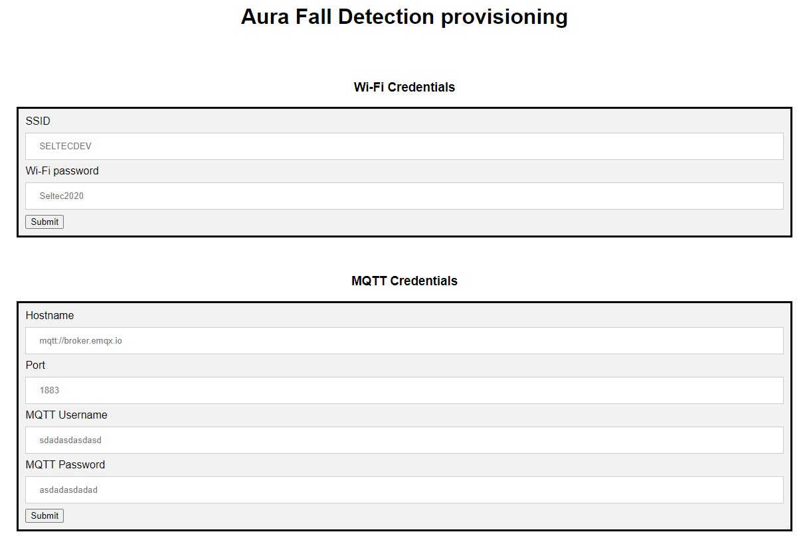

Network configurations
=================================
On first startup
*********************************

* The blue LED will be slow-blinking, indicating that it's in configuration mode, and the device will broadcast an access point with the name **aura_<serial number>**.
* Connect to this AP with the password **Seltec2022**.
* Go to `<192.168.4.1/>`_ and submit wifi and mqtt credentials.
* After you finished, press and hold the button until you hear a short buzz from the buzzer. The device will now be in operating mode.

.. note::
   MQTT hostname field require the **mqtt://** prefix to work.
   For example:  **mqtt://cloud.seltec.io**

From operating mode
********************************
* Press and hold the button until you hear a short buzz from the buzzer. 
* The blue LED will now be slow blinking, indicating that It's in coniguration mode.
* The device will broadcast an access point with the name **aura_<serial number>**.
* Connect to this AP with the password **Seltec2022**.
* Go to `<192.168.4.1/index/>`_ and submit wifi and mqtt credentials.
* After you finished, press and hold the button until you hear a short buzz from the buzzer. The device will now be in operating mode.

.. note::
   MQTT hostname field require the **mqtt://** prefix to work.
   For example:  **mqtt://cloud.seltec.io**

