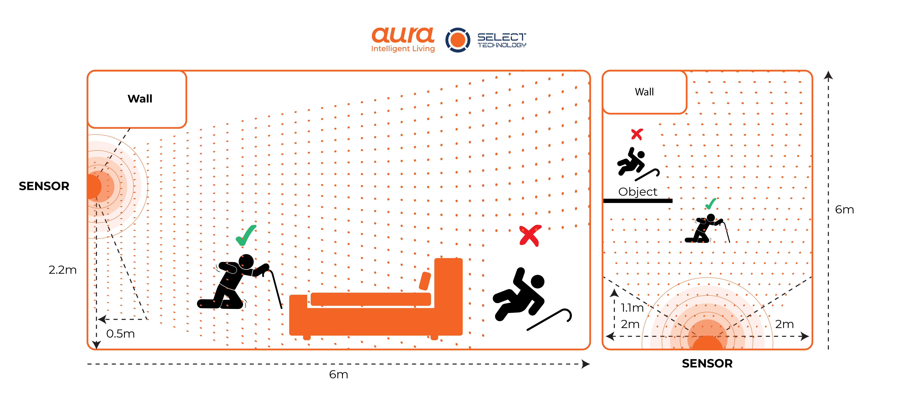

Installation manual
=================================

Positioning
*********************************
* For maximum efficiency, the device should be mounted on the wall opposite to the entrance of the room.
* It is recommended that the device is mounted at the height of 2.2 metres.
* Make sure the device if not tilted in any axis when mounted.
* **DO NOT** mount the device on interiors, windows, etc.

Blindspot 
*********************************
Device can't scan pass thick objects such as bed, wood or metal.

